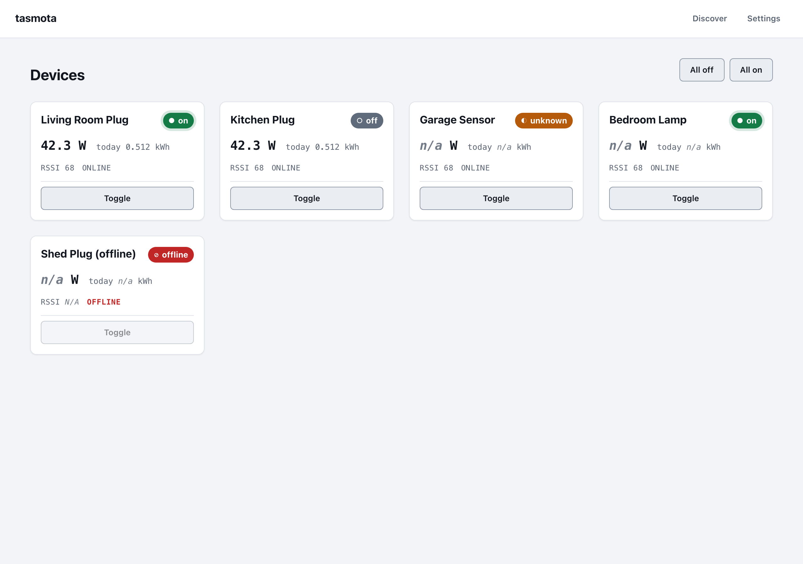
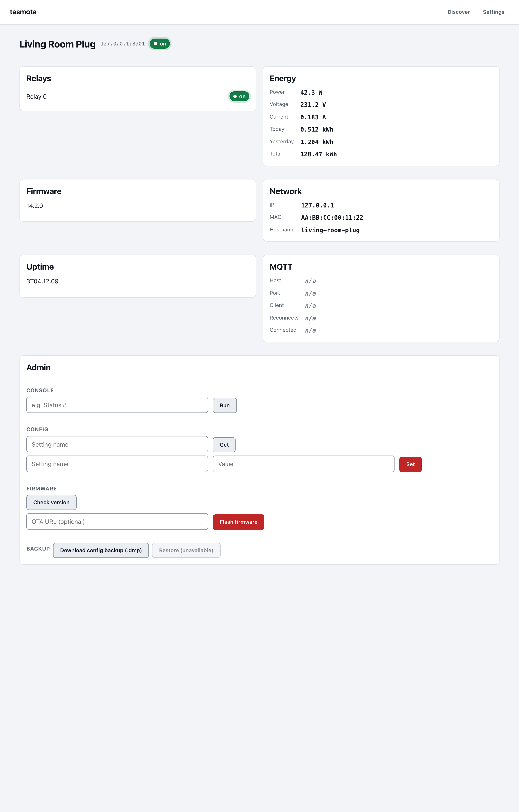
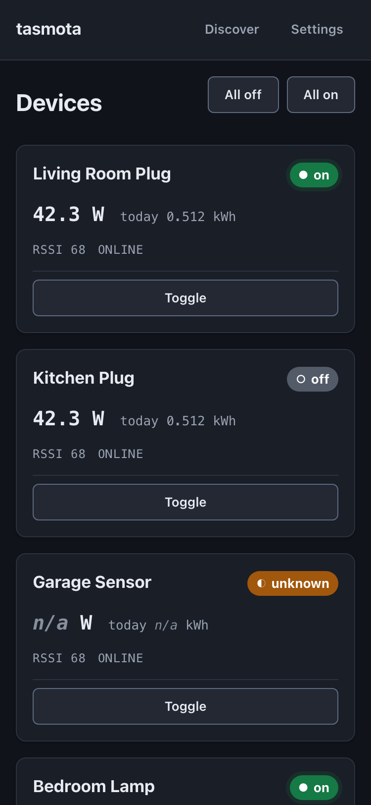

# plugboard

An unofficial, phone-first web dashboard and admin for
[Tasmota](https://tasmota.github.io/docs/) and [Shelly](https://shelly.cloud/)
smart devices: a live status grid, one-click on/off, energy readouts, discovery,
and a per-device admin panel (console, config, firmware), all in the browser.
Built with axum, maud, and htmx.

> This is a third-party tool. It is not affiliated with or endorsed by the
> Tasmota or Shelly projects. "Tasmota" and "Shelly" are used only to
> describe compatibility.

> plugboard is the multi-vendor successor to tasmota-web: the same app,
> renamed, with Shelly devices supported alongside Tasmota.

## Screenshots

| Dashboard (light) | Device admin |
| --- | --- |
|  |  |



## What it is

`plugboard` is a single self-contained binary: a live dashboard plus
per-device admin, talking directly to each device over HTTP. No MQTT broker,
no database, and no cloud dependency, the same no-broker-required model as
the vendor CLIs it sits alongside. CSS and JS are embedded in the binary (no
separate asset directory to deploy), and all device I/O reuses the published
`tasmota-core` and `shelly-core` libraries (via the shared `switchkit` trait),
so status parsing and safety guardrails match the CLIs exactly, for either
vendor.

It is a sibling to the `tasmota` and `shelly` CLIs: `plugboard` is the
browser-based counterpart for when you want a dashboard on your phone or a
wall-mounted tablet instead of a terminal.

## Features

- **Live dashboard grid** - every configured device as a card, updated over
  Server-Sent Events with no page reload.
- **One-click toggle** with a confirmed-state card and an undo toast.
- **Protected devices** (opt-in per device) require an extra confirmation
  before switching, for anything you don't want a stray tap to flip.
- **Bulk all-on / all-off**, with a confirmation step and a per-device
  success/failure summary.
- **Per-device detail**: relays, energy (power, voltage, current, today's/total
  kWh), firmware version, and network info.
- **Per-device admin panel**: console commands, config get/set, firmware
  check/update, and a config backup download, reusing the same shared,
  vendor-aware destructive-command guardrails as the CLIs
  (`switchkit::guardrail`), so a destructive or unclassifiable command always
  requires an explicit confirmation before it reaches the device, regardless
  of vendor.
- **Network discovery**: scan a CIDR range and add found devices to the
  config from the browser.
- **Settings**: manage the device list, per-device credentials, and the poll
  interval, all from the UI.
- **Optional built-in login** (argon2, rate-limited) for deployments that
  don't sit behind an auth-aware reverse proxy.
- **Prometheus `/metrics` endpoint**, unauthenticated by design, turning the
  app into a drop-in exporter for the whole fleet with no extra process.

## Install

### Cargo

```sh
cargo install plugboard
```

Requires Rust 1.90 or newer (the crate's `rust-version`).

### Homebrew

```sh
brew install rvben/tap/plugboard
```

### Docker

No image is published to a registry; build it from this repo's `Dockerfile`:

```sh
docker build -t plugboard .
docker run -d \
  --name plugboard \
  -p 8088:8088 \
  -v /path/to/plugboard.toml:/etc/plugboard/plugboard.toml:ro \
  plugboard
```

The image reads its config from `/etc/plugboard/plugboard.toml` (the
container's default `CMD`) and listens on `8088`, the same default bind port
as a local run. Never bake device credentials into the image, only mount them
in at runtime.

The mounted `plugboard.toml` **must** set `bind = "0.0.0.0:8088"`:

```toml
bind = "0.0.0.0:8088"
```

`plugboard`'s default bind (`127.0.0.1:8088`, see "Configuration" below) is
correct for a bare-metal deployment behind a reverse proxy on the same host,
but a container that binds container-internal loopback is unreachable from
outside the container - `-p 8088:8088` publishes the container's `8088`, not
its loopback interface. In a container, bind `0.0.0.0` and rely on Docker's
port publishing (and, if you front it with one, your reverse proxy) to
control what is actually exposed.

## Configuration

`plugboard` reads a TOML config file (default path `./plugboard.toml`,
override with `--config`). A minimal file with no `[[devices]]` entries and
no `[auth]` section is valid, everything has a default, but you'll usually
want at least one device:

```toml
# Address plugboard listens on. Defaults to 127.0.0.1:8088 if omitted.
bind = "127.0.0.1:8088"

# How often (in seconds) the poller refreshes device status in the
# background. Defaults to 5.
poll_interval_secs = 5

[auth]
# "proxy" (default): trust a reverse proxy in front of this app to have
# already authenticated the request. "builtin": require a login against
# username/password_hash below. See "Authentication" for details.
mode = "proxy"
# Required only when mode = "builtin".
# username = "admin"
# password_hash = "$argon2id$..."
# Set the Secure flag on the session cookie. Leave true (the default) behind
# TLS or on http://localhost; set false ONLY for a trusted plain-http LAN
# deployment (documented as insecure, see "Authentication" below).
cookie_secure = true

[[devices]]
name = "Living Room Lamp"
host = "192.0.2.10"
# Set true to require an extra confirmation before toggling this device.
protected = false
# Which vendor's client talks to this device: "tasmota" (default) or
# "shelly". Omit for a Tasmota device.

[[devices]]
name = "Freezer"
host = "192.0.2.11"
protected = true
# Only needed if the device has a web/console password set.
password = "device-web-password"

[[devices]]
name = "Garage Outlet"
host = "192.0.2.12"
vendor = "shelly"
```

Run it against that file:

```sh
plugboard --config /path/to/plugboard.toml
```

Devices can also be added, renamed, removed, and have their credentials or
`protected` flag changed from the Settings page in the running app, which
writes back to the same config file.

## Authentication

`plugboard` has two auth modes, set via `[auth] mode`:

- **`proxy`** (default): the app trusts that a reverse proxy in front of it
  (Authelia, or similar) has already authenticated the request. There is no
  built-in login; anyone who can reach the app can use it. This is the
  intended mode for a homelab deployment behind an authenticating proxy.
- **`builtin`**: a single admin login, handled by the app itself. Generate an
  argon2 password hash with the built-in subcommand:

  ```sh
  plugboard hash-password
  Password: <typed here, echoed>
  $argon2id$v=19$...
  ```

  or pipe it in non-interactively: `printf '%s' "$PW" | plugboard hash-password`.
  Paste the output into `[auth] password_hash`, set `[auth] username`, and set
  `[auth] mode = "builtin"`.

The session cookie is `Secure` by default (`cookie_secure = true`), which
works behind a TLS-terminating proxy and on `http://localhost` (browsers treat
localhost as a secure context either way). If you deploy `builtin` mode over
plain HTTP to a LAN IP (not `localhost`, no TLS), the browser will silently
refuse to store a `Secure` cookie and login will appear to fail; set
`cookie_secure = false` in that case, but treat it as insecure (the session
cookie then travels in the clear).

Regardless of mode: prefer binding to loopback or a private interface and
terminating TLS and, if you want it, authentication at a reverse proxy in
front of `plugboard`. `proxy` mode plus a proxy like Authelia is the
recommended setup; `builtin` mode exists for deployments that can't put an
authenticating proxy in front of the app.

## Data-honesty and safety

- Absent data (an offline device, a sensor a device doesn't have) always
  renders as `n/a`, never a coerced `0`. A missing reading, a device that
  doesn't report that field, and a genuine zero are different facts and are
  never collapsed into each other.
- There is no MQTT section: `plugboard`'s vendor-neutral device model
  (`switchkit::DeviceSnapshot`) carries no MQTT field for either Tasmota or
  Shelly, so the app never shows or guesses at an MQTT connection state.
- An offline device is shown as offline, its last-known values are not
  reused to fake a live reading.
- Destructive operations (firmware update, config set, console commands
  classified as destructive or unclassifiable) require an explicit
  confirmation before anything reaches the device, using the same shared,
  vendor-aware guardrail classification as the CLIs.
- `restore` (uploading a `.dmp` config backup to a device) is intentionally
  not wired to a route: its endpoint hasn't been verified against real
  hardware yet.
- Device credentials (per-device passwords) stay server-side; they are read
  from the config file and never sent to the browser.
- Every write request is checked for a session-bound CSRF token and
  same-origin (`Sec-Fetch-Site` / `Origin`) before it is allowed through,
  regardless of auth mode.

## Metrics (Prometheus)

`plugboard` already polls every configured device over HTTP, so it exposes
that same data at `GET /metrics` in the Prometheus text exposition format
(`0.0.4`), no MQTT broker and no separate exporter process needed. Every
per-device series carries a `vendor` label (`"tasmota"` or `"shelly"`), and
each vendor's real Wi-Fi signal unit gets its own series rather than a
fabricated cross-unit value.

**Enabled by default.** Set `metrics_enabled = false` in the config file to
turn the route into a plain 404.

```toml
# Serve GET /metrics for Prometheus scraping. Defaults to true.
metrics_enabled = true
```

**Unauthenticated by design.** The route sits outside every session/CSRF/login
layer, in both `proxy` and `builtin` auth mode, exactly like a static asset,
so a Prometheus server can scrape it directly with no credentials. This is
deliberate (Prometheus scrapers don't carry a session cookie), but it does
mean anyone who can reach the port can read it: bind to a private interface,
put it behind a network boundary, or set `metrics_enabled = false` if you
can't accept that.

### Absent means absent

The same data-honesty rule as the rest of the app applies here: a metric
series is emitted only when its value is actually known.

- An offline device emits `plugboard_device_reachable{...} 0` and NONE of
  its telemetry series, its last known values are never replayed as a live
  reading.
- A device with no energy sensor emits no `power_watts` / `energy_*` series
  at all, never a fabricated `0`.
- A relay in an unrecognized (`Unknown`) state emits no `relay_state` series
  for that relay, never a guessed on/off.
- A device reports its Wi-Fi signal in exactly one native unit, so it emits
  exactly one of `wifi_signal_percent` (Tasmota) / `wifi_rssi_dbm` (Shelly),
  never both and never a value converted into the other vendor's unit.
- `plugboard_device_reachable` is the one series always emitted per
  configured device, because reachability is always known: the last poll
  either succeeded or it did not.

### Metrics

| Metric | Type | Labels | Emitted when |
| --- | --- | --- | --- |
| `plugboard_build_info` | gauge | `version` | always (value `1`) |
| `plugboard_fleet_devices` | gauge | none | always |
| `plugboard_device_reachable` | gauge | `host`, `name`, `vendor` | always, per device |
| `plugboard_device_last_poll_success_timestamp_seconds` | gauge | `host`, `name`, `vendor` | once the device has ever had a successful poll |
| `plugboard_device_poll_total` | counter | `host`, `name`, `vendor`, `result` (`success`\|`error`) | always, per device (accumulates across fleet rebuilds) |
| `plugboard_device_power_watts` | gauge | `host`, `name`, `vendor` | reachable and the device reports live power |
| `plugboard_device_energy_today_kwh` | gauge | `host`, `name`, `vendor` | reachable and the device reports today's energy |
| `plugboard_device_energy_total_kwh` | gauge | `host`, `name`, `vendor` | reachable and the device reports cumulative energy |
| `plugboard_device_wifi_signal_percent` | gauge | `host`, `name`, `vendor` | reachable and the device has reported Wi-Fi signal as a percentage (Tasmota) |
| `plugboard_device_wifi_rssi_dbm` | gauge | `host`, `name`, `vendor` | reachable and the device has reported Wi-Fi signal in dBm (Shelly) |
| `plugboard_device_relay_state` | gauge | `host`, `name`, `vendor`, `relay` (index) | reachable and that relay's state is `On`/`Off` (not `Unknown`) |

`host` and `name` are Prometheus-label-escaped (backslash, quote, newline),
so a device name containing a `"` cannot break the exposition format. `vendor`
comes from a fixed lowercase set (`"tasmota"`/`"shelly"`), not user input, so
it needs no escaping.

### Scrape config

```yaml
scrape_configs:
  - job_name: plugboard
    static_configs:
      - targets: ["plugboard.example.com:8088"]
```

## Build / develop

```sh
make check   # fmt --check, clippy -D warnings, tests
make test
make lint
```

CI runs the same `make` targets. Related crates: `tasmota-core` and
`shelly-core` (the I/O-agnostic vendor libraries shared with the CLIs:
transport, status parsing, discovery, guardrails), `switchkit` (the shared
async trait and vendor-neutral types both clients implement), and this crate,
`plugboard`.

See [`tasmota`](https://github.com/rvben/tasmota-cli) and
[`shelly`](https://github.com/rvben/shelly-cli) for the command-line
counterparts.

## License

MIT
